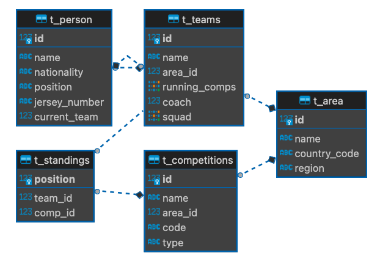
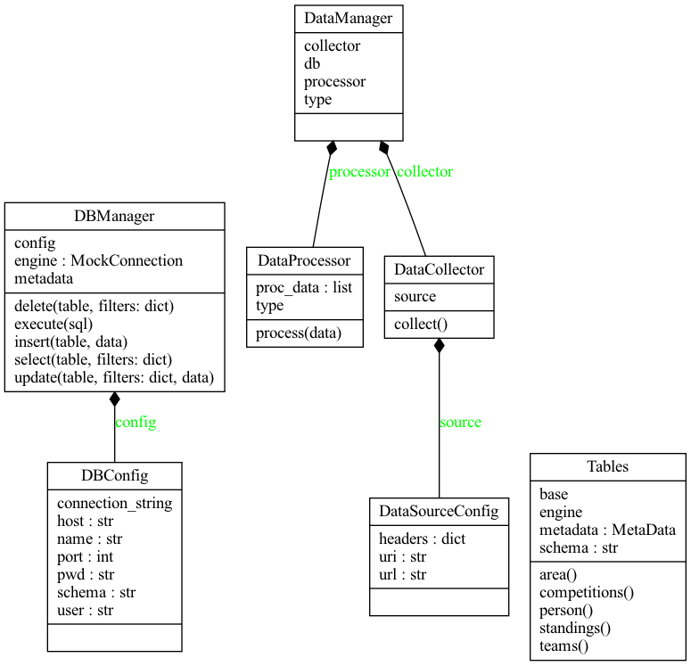
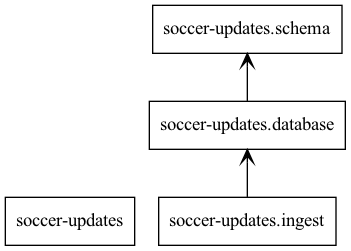

# soccer-updates
Updates from world of soccer in a single app

# Idea
Idea is to create a web application purely for sports updates. This website will be away from all the irrelevant sports news articles like in ESPN. It will contain only score updates for a sport across a competition and performance charts of a team or a player. The application does this by carefully curating data from different open-source sports data sources, analyzing this curated data to produce the score statistics and performance charts. Finally, the produced visualizations are presented to the user in a well designed website.

# Design
* Note: Currently developing the module for football data 
        API/Data source: https://www.football-data.org/

## Schema Diagram

## UML Diagram

## Packages
